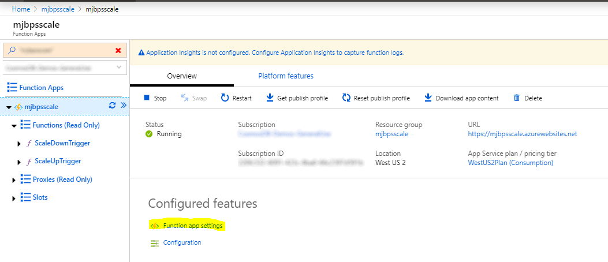
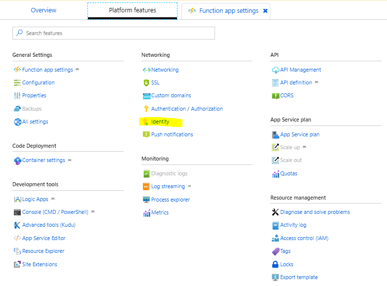
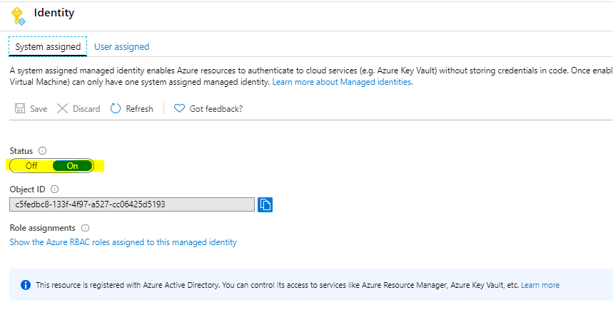
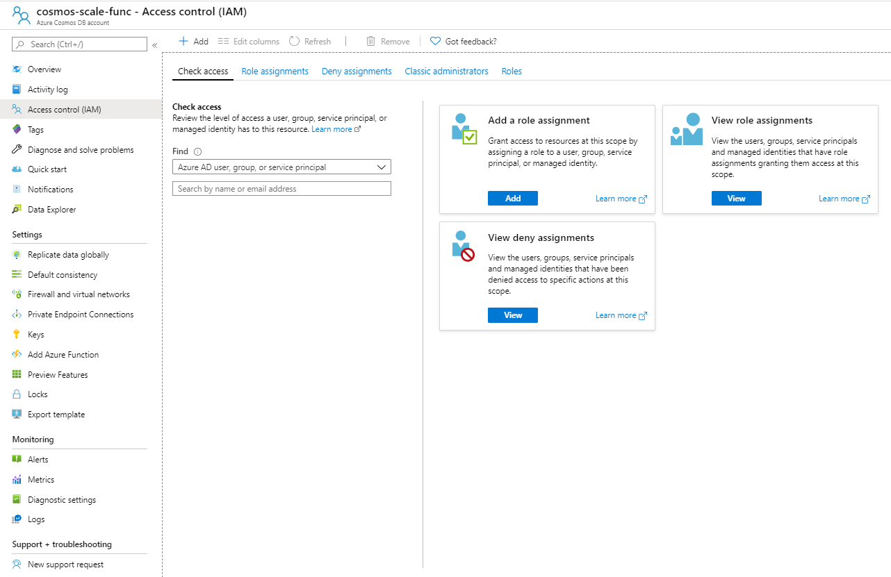
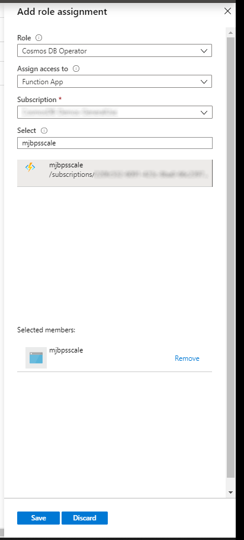

# Azure Cosmos DB Scale up/down on a Schedule

  

<!-- 
Guidelines on README format: https://review.docs.microsoft.com/help/onboard/admin/samples/concepts/readme-template?branch=master

Guidance on onboarding samples to docs.microsoft.com/samples: https://review.docs.microsoft.com/help/onboard/admin/samples/process/onboarding?branch=master

Taxonomies for products and languages: https://review.docs.microsoft.com/new-hope/information-architecture/metadata/taxonomies?branch=master
-->

This project consists of two Timer Triggers. A ScaleUpTrigger and a ScaleDownTrigger. The ScaleUpTrigger is configured to run at 8am, Monday-Friday and the ScaleDownTrigger is configured to run at 6pm Monday-Friday.

After cloning this repository locally, there are three things to modify to customize for use:

- **Resources:** Set the Cosmos DB resources to set throughput on for each trigger in `scale.json`
- **Schedule:** Set the schedule for each trigger in `functions.json`
- **Permissions:** Set the permissions for the Azure Function to set the throughput on the Cosmos DB account

## Resources

The `scale.json` specifies the Cosmos DB resources to set throughput on. Each trigger has its own scale.json file with its own throughput values. Within the file you can scale as many Cosmos DB resources as you want and works for all supported Cosmos DB model APIs. 

To scale a shared database or dedicated container-level resource, add an array entry to `scale.json` and specify the following attributes:

- **resourceGroup** - resource group for the Cosmos DB account.
- **account** - Cosmos DB account name.
- **resourceName** - database or database\container
- **throughput** - throughput to set for the resource

*resourceName* must be in `database` or `database\container` format. Here are some examples - SQL: `database1\container1`, Cassandra: `keyspace1\table1`, MongoDB: `database1\collection1`, Gremlin: `database1\graph1`, or Table: `table1`.

The example below demonstrates setting throughput on both a shared database and a dedicated container resource.

```json
[
    {
        "resourceGroup": "MyResourceGroup",
        "account": "my-cosmos-account",
        "resourceName": "myDatabase1",
        "throughput": 400
    },
    {
        "resourceGroup": "MyResourceGroup",
        "account": "my-cosmos-account",
        "resourceName": "myDatabase2/myContainer1",
        "throughput": 400
    }
]
```

## Schedule

Setting the schedule requires changing the "schedule" attribute in each Trigger's `functions.json` to the desires cron expression. To learn more about cron expressions, see [NCRONTAB expressions](https://docs.microsoft.com/en-us/azure/azure-functions/functions-bindings-timer?tabs=csharp#ncrontab-expressions)

## Permissions

When the Azure Function is deployed, you need to give it permissions to set throughput on every Azure Cosmos DB account it will access. To do this you need to create a System assigned Identity in Azure, via Platform Features/Identity and then give that System assigned identity Cosmos DB Operator rights to allow the Azure Function Triggers to set the throughput.

Follow these steps to do this.

### Step 1

Open the Azure Function app settings


### Step 2

Select Identity in Platform Features


### Step 3

Create a System assigned identity for the Azure Function


### Step 4

Open the Azure Cosmos DB account you want to let the Azure Function set the throughput for and select Access Control (IAM) and click on "Add" role assignments.


### Step 5

Finally, for "Role" select "Cosmos DB Operator", for "Assign access to" select " Function App", then select your subscription and the Azure Function app you have deployed this solution into.



## Prerequisites

- There are no prerequisites necessary to run this sample. Simply deploy it with modified timer in `functions.json` and Cosmos DB resources defined in `scale.json`.
- If you're looking to modify the PowerShell in this sample and are new to running PowerShell in Azure Functions, read [Create your first PowerShell function in Azure](https://docs.microsoft.com/azure/azure-functions/functions-create-first-function-powershell)
- The [Next Steps](https://docs.microsoft.com/en-us/azure/azure-functions/functions-create-first-function-powershell#next-steps) will have more details on debugging as well as a PowerShell developer guide.

## Setup

Clone the repository locally. Open in VS Code.

## Running the sample

- Open the folder in VS Code
- Edit the function.json file for each trigger to set the time it runs and edit the scale.json to define the resources to set the throughput for each time the trigger runs.
- To deploy, press F1, choose, "Azure Functions: Deploy to Function app", follow prompts to deploy to existing or create new Functions app in Azure.

## Contributing

This project welcomes contributions and suggestions.  Most contributions require you to agree to a
Contributor License Agreement (CLA) declaring that you have the right to, and actually do, grant us
the rights to use your contribution. For details, visit https://cla.opensource.microsoft.com.

When you submit a pull request, a CLA bot will automatically determine whether you need to provide
a CLA and decorate the PR appropriately (e.g., status check, comment). Simply follow the instructions
provided by the bot. You will only need to do this once across all repos using our CLA.

This project has adopted the [Microsoft Open Source Code of Conduct](https://opensource.microsoft.com/codeofconduct/).
For more information see the [Code of Conduct FAQ](https://opensource.microsoft.com/codeofconduct/faq/) or
contact [opencode@microsoft.com](mailto:opencode@microsoft.com) with any additional questions or comments.
